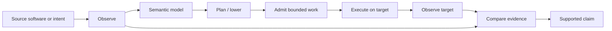

<div align="center">

# XCP

### Deterministic software adaptation and verified execution

**Observe source behaviour → represent meaning → lower to a bounded target → execute → measure what survived.**

[Architecture](docs/ARCHITECTURE.md) · [XVM](docs/XVM.md) · [Platform model](docs/PLATFORM_MODEL.md) · [Public evidence](snapshots/) · [Website](https://xcpstudio.com/)

</div>

XCP is an architecture for moving software intent or observed source behaviour toward a different execution target **without treating successful execution as proof of equivalence**.

Its first reference source family is **Godot**. Its first reference target is **Xbox Series through XVM**, a deterministic virtual machine designed to provide bounded programmability inside the public Xbox application sandbox.



| Layer | Current reference |
| --- | --- |
| Source | **Godot** |
| Semantic / adaptation | **XCP** |
| Execution substrate | **XVM** |
| First target | **Xbox Series** |
| Product surface | **XCP Studio** |
| Decision boundary | **Evidence, not successful execution alone** |

> **XVM does not escape the Xbox sandbox. It creates bounded programmability inside it.**

> [!IMPORTANT]
> **XCP-Research is the public architecture and evidence boundary, not the production source distribution.** The current implementation continues in a private research repository while a clean open-source XCP Platform is being extracted separately.

## The architecture in one sentence

**Source meaning and target mechanics are separate, execution is admitted before it is trusted, and claims cannot exceed the evidence collected after execution.**

Xbox, Godot, XVM, and XCP Studio are the current reference components. None of them alone defines XCP.

Read the full [architecture overview](docs/ARCHITECTURE.md).

## Why XVM exists

XCP needed a target that could execute new, bounded work without giving the producer unrestricted authority over the Xbox host.

XVM was built around that constraint.

The current XVM v2 reference implementation has a small deterministic ISA with **26 opcodes**, **16 registers**, typed memory, structured control, bounded loops and calls, static worst-case fuel analysis, deterministic snapshot/resume, and CPU/GPU differential execution paths.

> **XVM does not escape the Xbox sandbox. It creates bounded programmability inside it.**

See [docs/XVM.md](docs/XVM.md) for the architectural description and current publication boundary.

## Source meaning and target mechanics are separate

XCP does not assume that source and target share an engine, runtime, language, APIs, or implementation structure.

A source adapter observes declared behaviour. A semantic layer makes that behaviour explicit. A target adapter determines which parts can be represented under the destination's capabilities. The resulting candidate still has to run and be measured.

That separation is what makes paths such as these conceptually possible:

```text
Godot -> XCP -> Xbox/XVM
another engine -> XCP -> Xbox/XVM
Godot -> XCP -> another target
```

The first path is the one currently backed by public evidence in this repository. The others describe the platform boundary, not completed compatibility claims.

## Execution is not fidelity

XCP keeps several decisions separate:

```text
operability       Can the target execute the candidate?
semantic fidelity Did the declared behaviour survive?
equivalence       Is the evidence broad enough for a stronger claim?
```

A successful build or playable target does not automatically answer the second or third question.

This repository exists largely to make that distinction inspectable.

## Build it. Run it on the target. Decide from evidence.

XCP turns an idea or authorized source software into an explicit project, prepares a deterministic target candidate, runs it on real hardware, and returns structured evidence for the next decision.

It does not stop at a successful build. The question is what executed on the target, what happened there, and what the recorded evidence actually supports.

## Three public paths into one lifecycle

### Create


An AI-driven, human-directed workflow created an interactive prototype from an idea and brought it to real Xbox execution. The public programme result records **28 / 28** completed blind-agent lifecycle operations across an interactive game and a utility.

The claim is not that every generated project is correct. It is that the recorded lifecycle was exercised end to end, with evidence produced while the work ran.

### Adapt


XCP can study authorized source-to-target adaptation as a measured process rather than a file conversion. A public Minilens case completed **14 / 14** lifecycle operations and **5 / 5** semantic acceptance checks on Xbox.

The result is a playable behavioural subset with declared degradation. Full source equivalence is not claimed. Minilens remains the work of its authors and is used here under GPL-3.0-or-later as an authorized adaptation subject.

### Evolve


Software changes after the first run. XCP keeps the project lifecycle explicit across later source revisions and local decisions, then verifies the result as a new version. The public programme evidence records an exact update and rollback sequence: **1.0.0 -> 1.1.0 -> 1.0.0**.

The important distinction is that a rejected change can return to a known version rather than relying on a new rebuild that merely appears similar.

## Measured on real hardware

| Public evidence | Recorded result | What it supports |
| --- | ---: | --- |
| AI-driven creation lifecycle | **28 / 28** operations | A recorded end-to-end creation lifecycle on real hardware |
| Authorized source adaptation | **14 / 14** operations | A measured, bounded source-to-target adaptation case |
| Semantic acceptance | **5 / 5** checks | The declared adaptation scenario, not whole-project equivalence |
| Version evolution | **1.0.0 -> 1.1.0 -> 1.0.0** | Exact update and rollback under the recorded lifecycle |

These are selected programme results. They are not claims of universal source fidelity, unrestricted Xbox execution, or consumer publishing.

## Operational surface


XCP Studio brings project work, adaptation, evolution, target execution, and evidence into one measured workflow. Studio is a product surface around XCP; it is not the platform definition.

The planned platform boundary is described in [docs/PLATFORM_MODEL.md](docs/PLATFORM_MODEL.md).

## One evidence snapshot, fully inspectable


[Snapshot 001 - measured motion preservation](snapshots/001-g2-motion-validation/README.md) is a deliberately narrow, machine-checkable historical scenario. It binds source and target observations to the same declared motion case, executes the target, measures divergence, and records a bounded decision.

Its authority is intentionally specific:

- one declared `movement-left` source-to-target scenario;
- one measured divergence within the frozen tolerance;
- support for the stated scenario only;
- no whole-project fidelity decision.

The public repository includes the snapshot manifest, sanitized source and target summaries, differential report, schemas, tests, and an offline verifier. The proof boundary is public even though the transformation boundary is not.

## Verify the public evidence offline

Python 3.11 or newer is sufficient; there are no third-party runtime dependencies.

```bash
python verifier/verify.py snapshots/001-g2-motion-validation
python -m unittest discover -s tests -v
python verifier/audit.py .
```

Offline verification checks the integrity and internal consistency of the checked-out public evidence. Source authenticity is established separately through its trusted repository or release identity.

## Repository guide

| Area | Purpose |
| --- | --- |
| [docs/ARCHITECTURE.md](docs/ARCHITECTURE.md) | XCP system architecture and reference-component boundaries |
| [docs/XVM.md](docs/XVM.md) | XVM execution model and sandbox boundary |
| [docs/PLATFORM_MODEL.md](docs/PLATFORM_MODEL.md) | Platform invariants, Studio separation, and open-source direction |
| [docs/EVIDENCE_MODEL.md](docs/EVIDENCE_MODEL.md) | Evidence model |
| [docs/METHOD.md](docs/METHOD.md) | Research and decision method |
| [docs/SNAPSHOT_POLICY.md](docs/SNAPSHOT_POLICY.md) | Snapshot publication policy |
| [snapshots/](snapshots/) | Sanitized, bounded research evidence |
| [schemas/](schemas/) | Public evidence contracts |
| [verifier/](verifier/) | Offline verification and audit tools |
| [tests/](tests/) | Checks for claim boundaries and artifact integrity |
| [DISCLOSURE.md](DISCLOSURE.md) | What this public surface does and does not publish |

## Toward an open XCP Platform

XCP is currently developed in a private research repository that also contains historical experiments, product branches, Xbox operational tooling, and research material that does not belong in a stable public platform.

The intended open-source path is therefore **a clean platform extraction, not a visibility change on the historical repository**.

The candidate public surface includes stable specifications, reference runtime components, semantic and adapter contracts, evidence contracts, conformance tooling, and minimal examples. The exact boundary will be frozen only after the current research branches are reconciled.

Until then, XCP-Research remains the public architecture-and-evidence boundary.

## Public boundary

This repository intentionally publishes:

- the XCP architecture and platform thesis;
- the architectural role of XVM and the Xbox reference target;
- public product captures and representative outcomes;
- selected aggregate measurements and claim boundaries;
- sanitized, machine-readable evidence snapshots;
- methods for independently checking the public evidence.

It intentionally excludes:

- production application, toolchain, runtime, adapter, and infrastructure source code;
- private transformation procedures, internal operational schemas, prompts, and recipes;
- credentials, user data, project identifiers, and operational logs;
- artifacts or parameters intended to reconstruct private implementation.

> **Publish the proof boundary, not the implementation boundary.**

## License and contact

Original repository content is licensed under [Apache License 2.0](LICENSE). No Minilens source, assets, traces, binaries, or other third-party material is redistributed here; only factual identities, public captures, and sanitized measurements are included.

For the product context and contact path, visit [xcpstudio.com](https://xcpstudio.com/).
