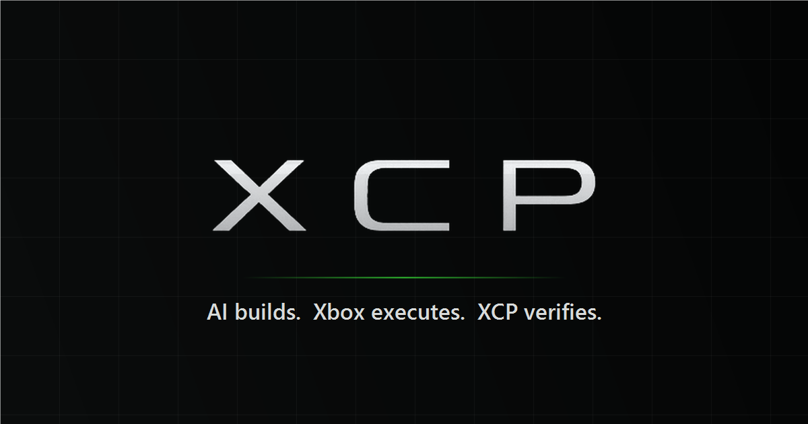
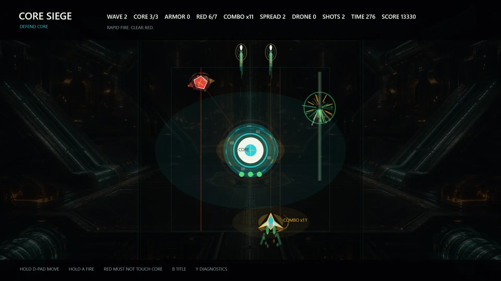
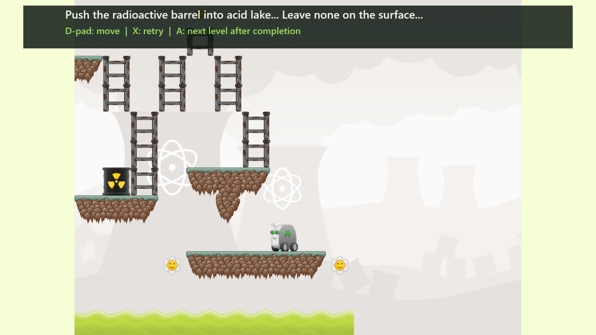
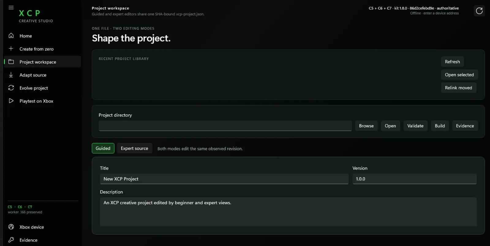
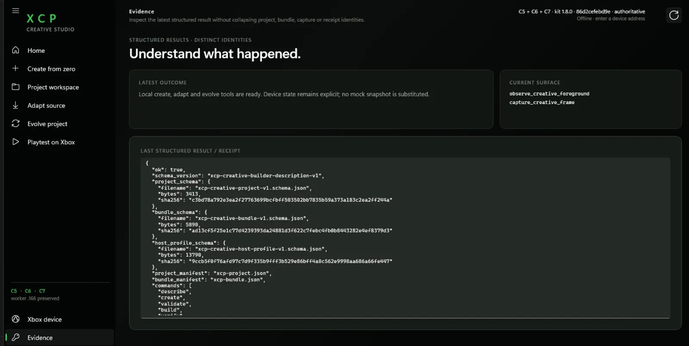
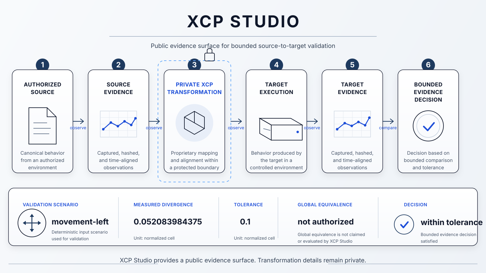

  

  # XCP Technical Showcase

  **AI software creation, source-to-target adaptation, and measured Xbox execution.**

  [Website](https://xcpstudio.com/) · [Architecture & evidence](https://xcpstudio.com/architecture.html) · [Availability](https://xcpstudio.com/availability.html)

> [!IMPORTANT]
> This is a public technical showcase and evidence repository, not a source distribution. It contains product documentation, public captures, aggregate measurements, and deliberately bounded evidence snapshots. XCP production code, private transformation internals, prompts, credentials, and operational interfaces are not included.

## Build it. Run it on the target. Decide from evidence.

XCP turns an idea or authorized source software into an editable project, prepares a deterministic execution, runs it on real Xbox Series hardware, and returns structured evidence for the next decision.

It does not stop at a successful build. The question is whether the result executed on the target, what happened there, and what the recorded evidence actually supports.

\`\`\`mermaid
flowchart LR
    A[Idea or authorized source] --> B[XCP project]
    B --> C[Deterministic preparation]
    C --> D[Measured Xbox execution]
    D --> E[Observations and captures]
    E --> F[Evidence decision]
    F --> G[Correct, evolve, or roll back]
\`\`\`

## Three public paths into one lifecycle

### Create

An AI-driven, human-directed workflow created an interactive prototype from an idea and brought it to real Xbox execution. The public programme result records **28 / 28** completed blind-agent lifecycle operations across an interactive game and a utility.

The claim is not that every generated project is correct. It is that the recorded lifecycle was exercised end to end, with evidence produced while the work ran.

### Adapt

XCP can study authorized source-to-target adaptation as a measured process rather than a file conversion. A public Minilens case completed **14 / 14** lifecycle operations and **5 / 5** semantic acceptance checks on Xbox.

The result is a playable behavioural subset with declared degradation. Full source equivalence is not claimed. Minilens remains the work of its authors and is used here under GPL-3.0-or-later as an authorized adaptation subject.

### Evolve

Software changes after the first run. XCP keeps the project lifecycle explicit across later source revisions and local decisions, then verifies the result as a new version. The public programme evidence records an exact update and rollback sequence: **1.0.0 -> 1.1.0 -> 1.0.0**.

The important distinction is that a rejected change can return to a known version rather than relying on a new rebuild that merely appears similar.

## Measured on real hardware

| Public evidence | Recorded result | What it supports |
| --- | ---: | --- |
| AI-driven creation lifecycle | **28 / 28** operations | A recorded end-to-end creation lifecycle on real hardware |
| Authorized source adaptation | **14 / 14** operations | A measured, bounded source-to-target adaptation case |
| Semantic acceptance | **5 / 5** checks | The declared adaptation scenario, not whole-project equivalence |
| Version evolution | **1.0.0 -> 1.1.0 -> 1.0.0** | Exact update and rollback under the recorded lifecycle |

These are selected programme results. Their scope, claim boundaries, and platform limits are stated on the [XCP Architecture & Evidence](https://xcpstudio.com/architecture.html) page. They are not claims of universal source fidelity, unrestricted Xbox execution, or consumer publishing.

## Operational surface

XCP Studio brings project work, adaptation, evolution, target execution, and evidence into one measured workflow. The public captures show the product surface; the private implementation that produces the candidate target remains outside this repository.

## One evidence snapshot, fully inspectable

[Snapshot 001 - measured motion preservation](snapshots/001-g2-motion-validation/README.md) is a deliberately narrow, machine-checkable historical scenario. It binds source and target observations to the same declared motion case, executes the target, measures divergence, and records a bounded decision.

Its authority is intentionally specific:

- one declared \`movement-left\` source-to-target scenario;
- one measured divergence within the frozen tolerance;
- support for the stated scenario only;
- no whole-project fidelity decision.

The public repository includes the snapshot manifest, sanitized source and target summaries, differential report, schemas, tests, and an offline verifier. The proof boundary is public even though the transformation boundary is not.

## Verify the public evidence offline

Python 3.11 or newer is sufficient; there are no third-party runtime dependencies.

\`\`\`bash
python verifier/verify.py snapshots/001-g2-motion-validation
python -m unittest discover -s tests -v
python verifier/audit.py .
\`\`\`

Offline verification checks the integrity and internal consistency of the checked-out public evidence. Source authenticity is established separately through its trusted repository or release identity.

## Repository guide

| Area | Purpose |
| --- | --- |
| [docs/](docs/) | Evidence model, method, and snapshot policy |
| [snapshots/](snapshots/) | Sanitized, bounded research evidence |
| [schemas/](schemas/) | Public evidence contracts |
| [verifier/](verifier/) | Offline verification and audit tools |
| [tests/](tests/) | Checks for claim boundaries and artifact integrity |
| [DISCLOSURE.md](DISCLOSURE.md) | What this public surface does and does not publish |

## Public boundary

This repository intentionally publishes:

- the XCP product thesis and conceptual lifecycle;
- public product captures and representative outcomes;
- selected aggregate measurements and claim boundaries;
- sanitized, machine-readable evidence snapshots;
- methods for independently checking the public evidence.

It intentionally excludes:

- application, toolchain, runtime, adapter, and infrastructure source code;
- private transformation procedures, internal schemas, prompts, and recipes;
- credentials, user data, project identifiers, and operational logs;
- artifacts or parameters intended to reconstruct proprietary implementation.

> **Publish the proof boundary, not the implementation boundary.**

## License and contact

Original repository content is licensed under [Apache License 2.0](LICENSE). No Minilens source, assets, traces, binaries, or other third-party material is redistributed here; only factual identities, public captures, and sanitized measurements are included.

For the product context and contact path, visit [xcpstudio.com](https://xcpstudio.com/).

