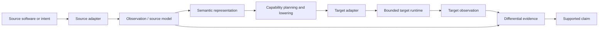

# XCP Architecture

XCP is a deterministic software adaptation and execution architecture.

It separates source meaning from target mechanics, admits bounded work before execution, and measures what survived instead of treating successful execution as proof of equivalence.

Xbox and Godot are the first reference implementations around this architecture. They are not the definition of XCP.

## System view



The important boundary is not a particular engine or console. It is the contract between the stages.

## 1. Source side

A source adapter is responsible for understanding an authorized source system well enough to produce explicit observations and a source model.

It does not need to reproduce the original implementation structure. It needs to expose the semantics that matter for the declared adaptation scope.

The current research programme uses Godot as the first reference source family. Public Minilens evidence in this repository demonstrates a deliberately narrow Godot-to-Xbox adaptation case.

## 2. Semantic layer

The semantic layer exists so that source and target do not need to share:

- engine;
- programming language;
- runtime APIs;
- object model;
- rendering stack;
- storage model;
- input system.

Observed source behaviour is projected into explicit semantic structures and invariants. Unsupported or unresolved behaviour remains explicit rather than being silently treated as preserved.

This layer is the reason XCP can be discussed as a platform rather than as a one-off converter.

## 3. Capability planning and lowering

The target is allowed to be different from the source.

XCP therefore treats adaptation as a constrained lowering problem: determine which declared semantics can be represented by the target, under which capabilities, and with which known degradations.

A target plan is not a claim of fidelity. It is an executable candidate that still has to be measured.

## 4. Target execution

The first reference target is Xbox Series through XVM.

XVM provides bounded deterministic programmability inside the public Xbox application sandbox. It is designed around the sandbox boundary rather than attempting to escape it.

The target runtime can reject work before execution when the submitted program or resource contract is outside the admitted profile.

See [XVM.md](XVM.md) for the public architectural description.

## 5. Observation and evidence

Execution success and semantic preservation are separate decisions.

XCP therefore records source observations, target observations, declared tolerances, identities, and differential results as evidence. A later decision may support a narrow scenario while still refusing a broader equivalence claim.

```text
operability       Can the target run the candidate?
fidelity          Did the declared behaviour survive?
equivalence       Is the evidence broad enough for a stronger claim?
```

These states must not be collapsed into one another.

## Reference implementation map

| Architectural role | Current reference | Status |
| --- | --- | --- |
| Source adapter | Godot | Research reference |
| Semantic representation | XCP semantic / adaptation contracts | Private implementation, public evidence boundary |
| Target runtime | XVM on Xbox Series | Research reference |
| Evidence model | XCP evidence contracts and verifier | Public subset in this repository |
| Product orchestration | XCP Studio | Separate product surface |

## Create, Adapt, Evolve

The public product language maps onto the same architecture:

### Create

Start from an intent, produce an XCP project, prepare admitted target work, execute it, and inspect evidence.

### Adapt

Start from authorized source software, observe it, build a semantic model, lower a supported subset to the target, execute it, and measure divergence.

### Evolve

Treat a later version as a new evidence-bearing state. Update, validate, and retain the ability to return to a known prior version instead of assuming a rebuild is equivalent.

## What XCP is not

XCP is not defined as:

- an Xbox game converter;
- a jailbreak or sandbox escape;
- a Godot-specific transpiler;
- an AI code generator;
- a claim that successful execution implies equivalence.

The current implementation uses AI-assisted workflows in some paths, but the architecture does not require an AI producer.

## Public boundary today

This repository publishes architecture, evidence contracts, sanitized snapshots, and offline verification tools.

The current production implementation, adapter internals, target runtime source, operational interfaces, credentials, and private research history remain outside this repository.

The planned open-source extraction will be a clean platform repository rather than a visibility change on the historical private research repository.

That future repository is intended to expose stable platform surfaces such as specifications, reference runtime components, adapter contracts, evidence contracts, and conformance tooling when those boundaries are ready.